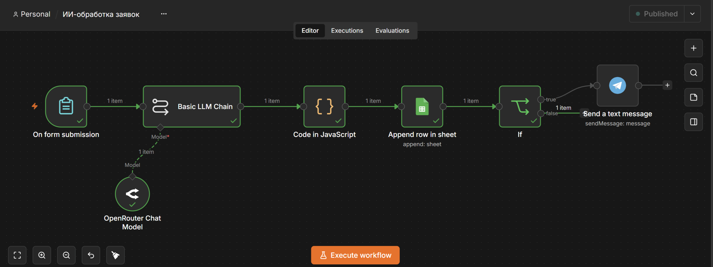
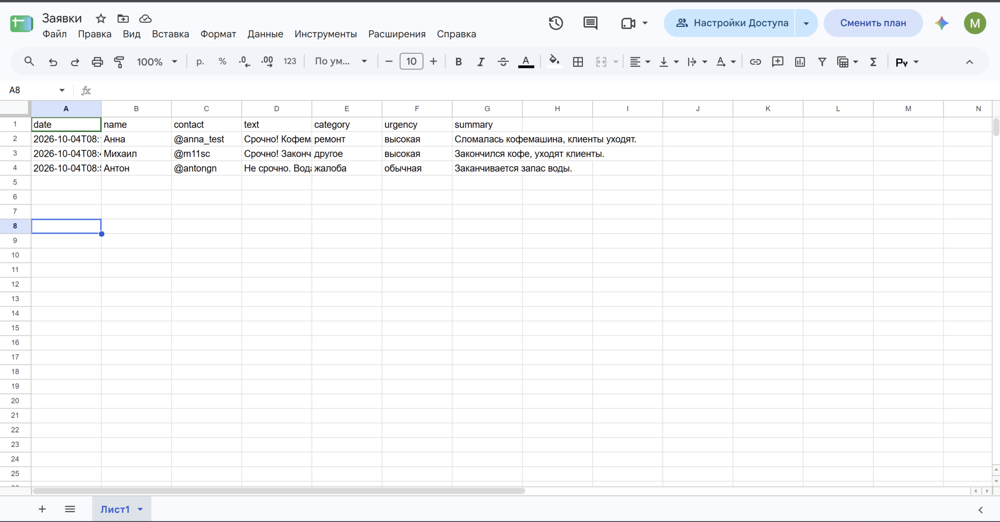
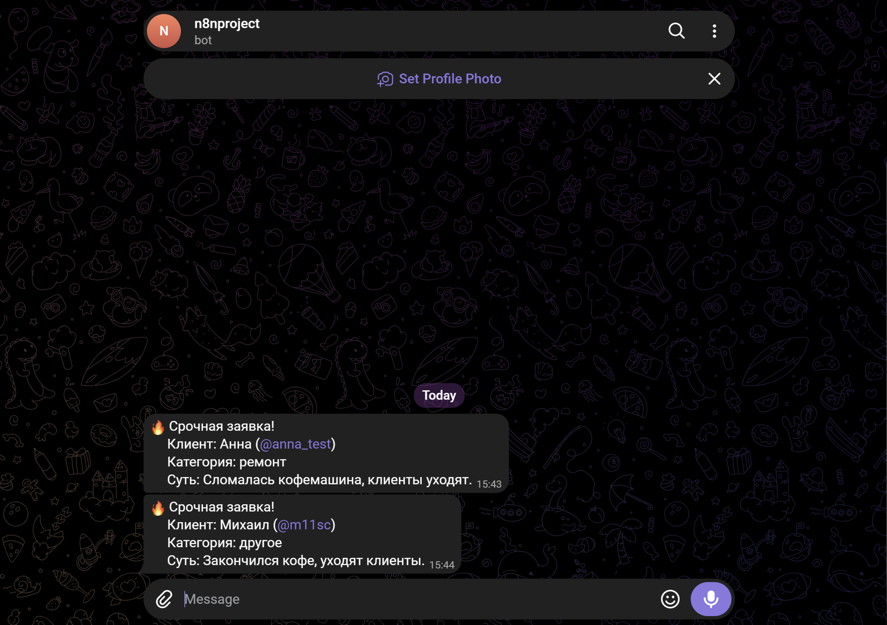

# ИИ-обработка заявок (n8n)

Автоматизация для малого бизнеса: заявка из веб-формы сама разбирается нейросетью, записывается в Google Sheets, а о срочных заявках сразу приходит уведомление в Telegram.



## Как работает

1. **Форма** (n8n Form Trigger) — клиент оставляет имя, контакт и текст заявки.
2. **Нейросеть** (Basic LLM Chain + OpenRouter, модель DeepSeek) — определяет категорию (ремонт / консультация / жалоба / другое), срочность и пишет краткое резюме. Ответ — строго в JSON.
3. **Code (JavaScript)** — достаёт JSON из ответа модели. Если модель ответила некорректно, заявка не теряется, а помечается как «не распознано».
4. **Google Sheets** — заявка добавляется строкой в таблицу.
5. **If** — проверяет срочность.
6. **Telegram** — по срочной заявке отправляет уведомление ответственному.

## Пример

Заявка: «Срочно! Сломалась кофемашина, клиенты уходят»

Результат в таблице:

| category | urgency | summary |
|---|---|---|
| ремонт | высокая | Сломалась кофемашина, клиенты уходят. |

И сообщение в Telegram:

```
🔥 Срочная заявка!
Клиент: Анна (@anna_test)
Категория: ремонт
Суть: Сломалась кофемашина, клиенты уходят.
```




## Стек

n8n · LLM API (OpenRouter) · промпт-инжиниринг · JavaScript · Google Sheets API · Telegram Bot API

## Как запустить

1. Установить n8n: `npm install -g n8n`, запустить `n8n`.
2. Импортировать `workflow.json`: меню → Import from File.
3. Подключить свои credentials:
   - **OpenRouter** — API-ключ с openrouter.ai;
   - **Google Sheets** — сервисный аккаунт Google Cloud (включить Google Sheets API и Google Drive API, поделиться таблицей с email аккаунта);
   - **Telegram** — токен бота от @BotFather.
4. Создать таблицу с заголовками: `date | name | contact | text | category | urgency | summary`.
5. Заменить `YOUR_SHEET_ID` и `YOUR_CHAT_ID` на свои значения.
6. Нажать **Execute workflow** и отправить тестовую заявку.

## Автор

Михаил Чупин — Telegram: [@m11sc](https://t.me/m11sc)
